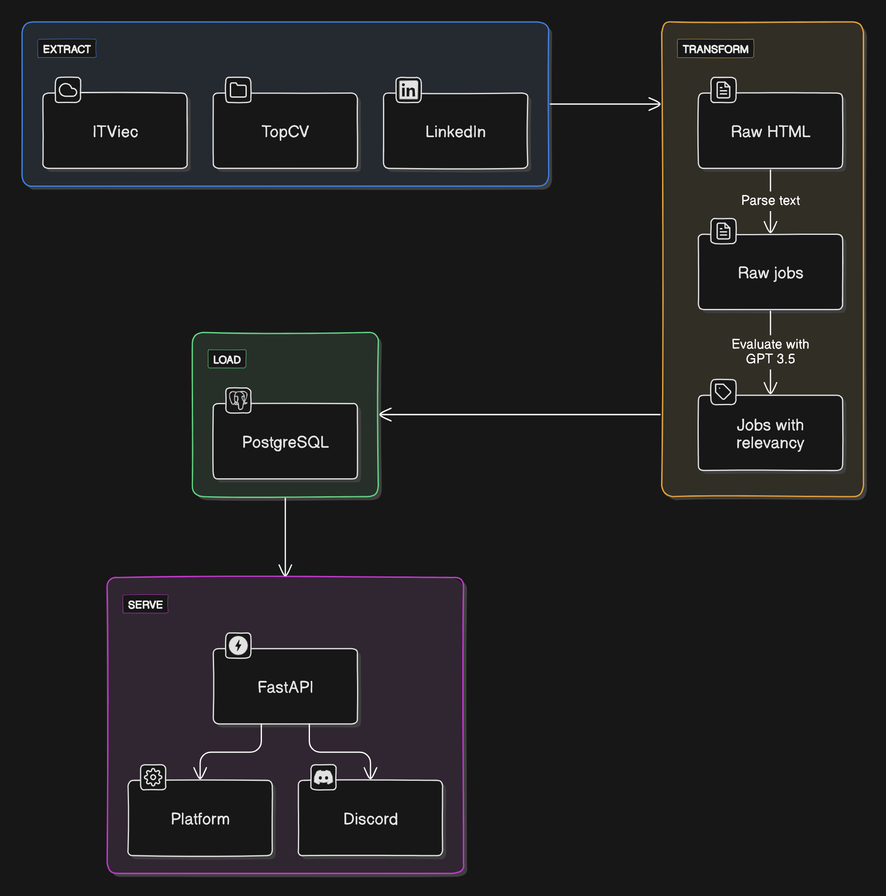

# Job Matching Assistant


This project automates the job search process by:

1. Crawling: Extracting job listings from multiple platforms (TopCV, ITviec, LinkedIn).
2. Filtering: Evaluating each job's relevance to a candidate's profile based on experience and skills, eliminating unsuitable listings.
3. Output: Generating structured JSON files with the filtered and scored job data for easy review.

## Features
- **Multi-Platform Scraping**: Collects a diverse range of job postings to expand the candidate's options.
- **Intelligent Filtering**: Leverages AI to assess job suitability based on a candidate's profile.
- **Structured Output**: Provides clean JSON files with relevant job details and relevancy scores.
- **Customizable**: Easily adapt the candidate profile or the filtering criteria to fit specific needs.
- **Efficient**: Automates a time-consuming aspect of job hunting.



## File Structure
```
scripts/
├── data/
│   ├── filter/          (Filtered job data with relevancy scores > 50)
│   ├── processed/       (Evaluate job data with relevancy scores)
│   └── raw/             (Raw job data scraped from sources)
├── scrapers/            (Scripts for scraping job boards)
│   ├── itviec.py        
│   ├── linkedin.py      
│   └── topcv.py         
├── scrape.py              (Main job scraper script)
├── filter.py              (Main job filter script)
├── upload.py              (Main job upload script)
├── script.sh              (Combined pipeline in bash script)
```

## Installation and Setup
### 1. Prerequisites:
- Ensure Python 3.x and required packages (`bs4`, `requests`, `json`, `datetime`, `dotenv`, `langchain_openai`, `langchain_core`) are installed.
- Install required packages: `pip install -r requirements.txt`
- OpenAI API key (add to your `.env` file)

### 2. Configuration:

- Set up your .env file with the OpenAI API key:
```bash
OPENAI_API_KEY=your_api_key_here
```
- Customize the `data/profile.json` file to match the candidate's experience, skills, and preferences.

## Usage
### 1. Crawl Job Data:
Run `scripts/scrape.py`. This will scrape the specified job boards and save raw data to `data/raw/`.
### 2. Filtered and Scored Jobs:
Run `scripts/filter.py` and review the output files in `data/processed/`. Each file will contain jobs tailored to the candidate's profile, with a "suitability" score indicating their relevance.
### 3. Upload Jobs:
Run `scripts/upload.py` to upload the processed jobs to the API.

## Customization
- Candidate Profile: Adjust `data/profile.json` to accurately reflect the candidate's information.
- Filtering Criteria: Modify the prompt within `JobMatchingAssistant` in `main.py` to refine how jobs are evaluated.
- Additional Job Boards: Expand the `scrapers/` directory with scripts to crawl more platforms.

## Future Enhancements
- [ ] UI: Build a user interface for easier input of candidate details and viewing of results.
- [x] Scheduler: Automatically run the scraper on a schedule to keep job data fresh.
- [x] Sorting: Add options to sort the filtered jobs by relevancy, date posted, or other factors.